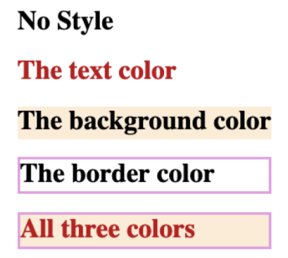
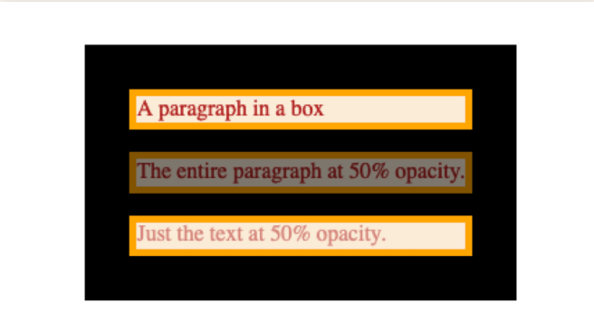
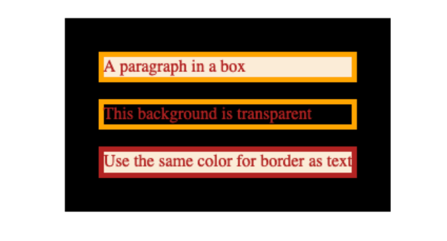
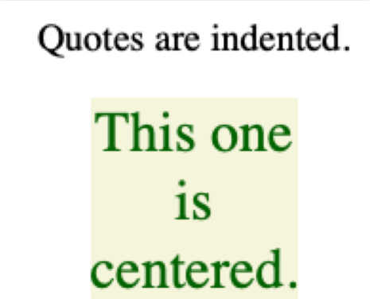

# Applying Styles with CSS3

## CSS Style Declarations
```css
background-color: beige;
color: darkgreen;
text-align: center;
font-size: 24px;
font-style: bold;
border: 1px solid cyan;
```

## Inline Styles
```html
This is some
<span
    style="
        background-color: beige;
        color: darkgreen;
        text-align: center;
        font-size: 24px;
        font-style: bold;
        border: 1px solid cyan;">
    stylish
</span>
```

## CSS Syntax

### Defining element styles
```html
h1 {
    background-color: beige;
    color: darkgreen;
    text-align: center;
    font-size: 24px;
    font-style: bold;
    border: 1px solid cyan;
}
```
So the HTML will look like this:
```html
<!doctype html>
<html>
    <head>
        <style>
            h1 {
                background-color: beige;
                color: darkgreen;
                text-align: center;
                font-size: 24px;
                font-style: bold;
                border: 1px solid cyan;
            }
        </style>
    </head>
    <body>
        <!-- html content goes here -->
    </body>
</html>
```

### Put your CSS in its own file
```html
<!doctype html>
<html>
    <head>
        <link rel="stylesheet" href="page.css" />
    </head>
    <body>
        <!-- html content goes here -->
    </body>
</html>
```

## Color in CSS
```html
<h1>No Style</h1>

<h1 style="color: fireBrick">
  The text color
</h1>

<h1 style="background-color: antiquewhite">
  The background color
</h1>

<h1 style="border-color: plum; border-style: solid">
  The border color
</h1>

<h1 style="color: fireBrick; background-color: antiquewhite; border-color: plum; border-style: solid">
  All three colors
</h1>
```


### Color Values:
These are all the same color:
```css
em {
  color: rebeccapurple;
}
em {
  color: #663399;
}
em {
  color: #639;
}
em {
  color: rgb(102 51 153);
}
em {
  color: hsl(270deg 50% 40%);
}
```

### Opacity and Alpha channel:
```css
p {
  background-color: antiquewhite;
  color: firebrick;
  border: 5px solid orange;
}
.fifty {
  opacity: 50%;
}
.fifty-text {
  color: rgba(178, 34, 34, 0.5);
  /* OR */
  color: rgb(178 34 34 / 50%);
}
```


### `transparent` and `currentColor` colors:
```css
.transparent-bg {
  background-color: transparent;
}

.matching-border {
  border-color: currentcolor;
}
```


### Contrasting Colors
- Some colors when put together cause accessibility problems.
- Use [this website](webaim.org/resources/contrastchecker) to check if the colors work together.

## CSS Selectors
```css
h1 { … }

.fancy { … }

#Chapter01 { … }
```

```html
<h1>Selected by element type</h1>

<h1 class="fancy">Selected by class name</h1>

<h1 id="Chapter01">Selected by ID</h1>
```

Each of these texts will look different.

### What is a Class?
**class** (Mathematics, Set Theory): a collection of sets (or sometimes other mathematical objects) that can be unambiguously defined by a property that all its members share

#### A CSS Class is a named style

**HTML:**
```html
<blockquote>
  Quotes are indented.
</blockquote>

<blockquote class="benday">
  This one is centered.
</blockquote>
```

**CSS:**
```css
.benday {
  background-color: beige;
  color: darkgreen;
  text-align: center;
  font-size: 24px;
  width: min-content;
  margin: 0 auto;
}
```
